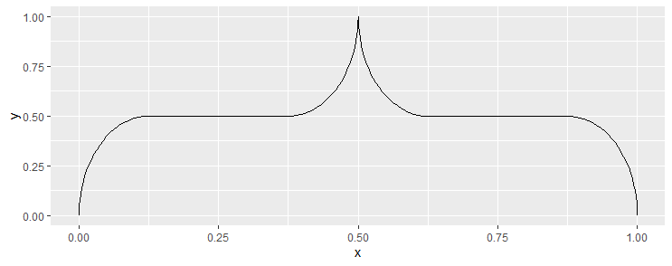
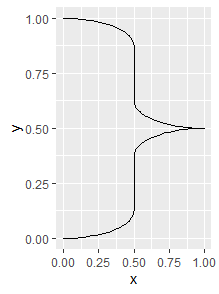
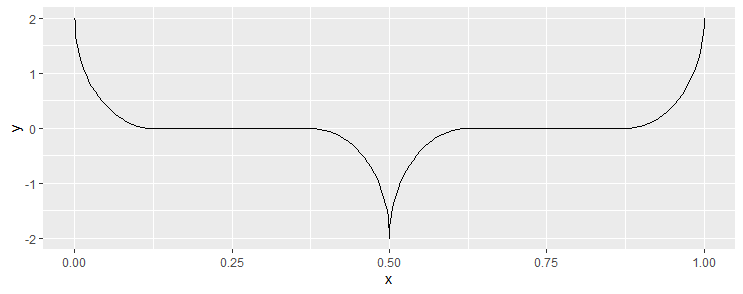
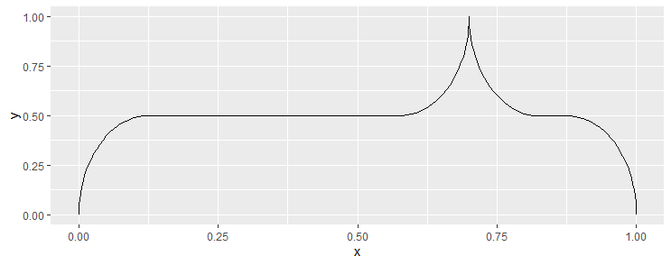
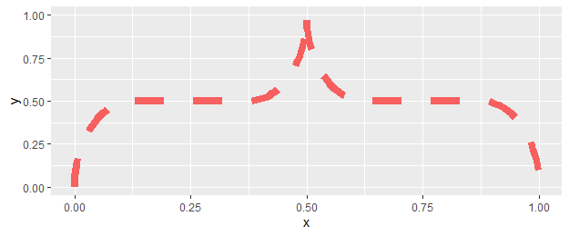

# ggbrace

Wanna draw curly braces in ggplot? This package provides the function geom_brace(), which gives a nice curly brace.

## Installation
Install the ggbrace package from the git repository:
``` r
devtools::install_github("solatar/ggbrace")
```

## Default braces
Load the package, create your first brace in [ggplot2](https://ggplot2.tidyverse.org/):
``` r
library(ggbrace)
library(ggplot2)

ggplot() + geom_brace()
```


We can also produce a brace that points sideways instead of up or down. However, we must then spefify the orientation parameter in ggplot, otherwise our brace will end up as a zickzack line (if for some reason the above already results in a zickzack line for you, specify orientation="x"):

``` r
ggplot() + geom_brace(pointing="side")
```

You can add the geom_line() to your plot of choice to include the brace. Specify its x and y coordinates to put it wherever you want (see below).

## Custom braces
To put braces wherever you want in your graph, we can change the x and y coordinates of the bracket. This can also change where the bracket is pointing to. If yend is smaller then ystart, the brace will point downwards. If xend is smaller than xstart and parameter="side" is specified, it will point to the left.

``` r
ggplot() + geom_brace(ystart=2, yend= -2)
```

To change where the brace is pointing, we change the mid parameter. This is always between 0.25 and 0.75 (even if you type in something smaller or higher), with 0.5 being the default. 

``` r
ggplot() + geom_brace(mid=0.7)
```


## Customization via ggplot2
To change how the brace looks like, simply provide the arguements needed by ggplot. This includes the arguements: size, color and linetype (dashed, dotted, etc.)
``` r
ggplot() + geom_brace(linetype="dashed", color="red", size=3)
```


If the size is bigger than usual, it might make sense to specify how the ends of the brace look like. This can be specified via the lineend and linejoin options (inherent to the ggplot2's geom_path object). They lead to subtle differences. The defaults are: lineend="butt" and linejoin="round".

Here are the possible options for lineend (default is "butt"), which influences the ends of the brace.
``` r
ggplot() + geom_brace(size=5, lineend="butt")
ggplot() + geom_brace(size=5, lineend="square")
ggplot() + geom_brace(size=5, linejoin="bevel")
```

 And here for linejoin (default is "round"), which influences the pointer.
``` r
ggplot() + geom_brace(size=5, linejoin="mitre")
ggplot() + geom_brace(size=5, linejoin="bevel")
ggplot() + geom_brace(size=5, linejoin="round")
```

## Creating a brace data.frame
If you want more flexibility, you might prefer the data frame the brace is built from. For that you can call the seekBrace() function. It takes the same parameters as the geom_brace() function, except ggplot specifics like color, size, line_type, etc. and produces a data.frame from it. You can use edit this data.frame as you wish and then plug it into a geom_path object to plot it with ggplot.
``` r
mybrace <- seekBrace()
ggplot() + geom_path(aes(x,y), data=mybrace)
```
