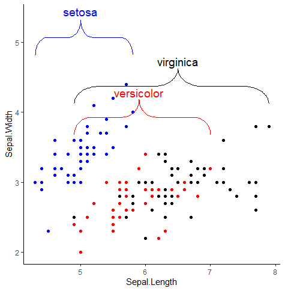
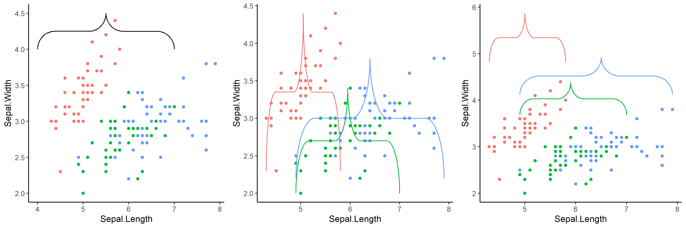
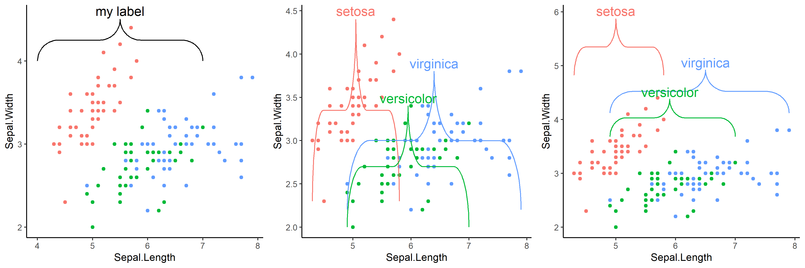
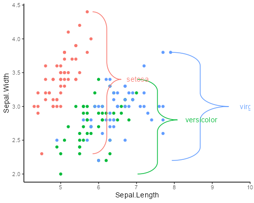
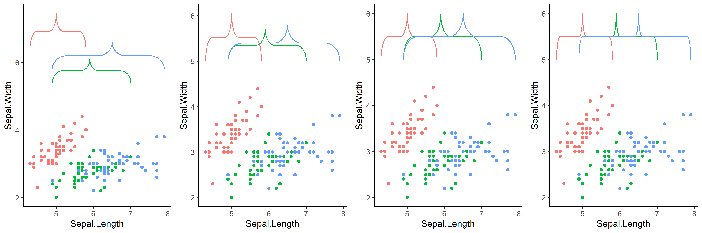
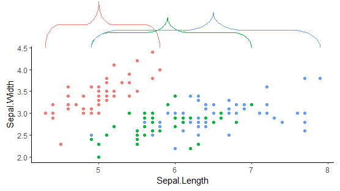

# ggbrace

An R package that draws highly modifiable curly braces in [ggplot2](https://ggplot2.tidyverse.org/). The brace can easily be modified and added to an existing ggplot object. ggbrace vizualizes the brace using a ggplot2's geom_path layer.



Table of contents:

- [Installation](#Installation)
- [Default braces](#Default-braces)
- [Labels](#Labels)
- [Outside of plotting area](#Outside-of-plotting-area)
- [Brace Customization](#Brace-Customization)
- [Label Customization](#Label-Customization)

# Installation
Install the package from the git repository:
``` r
devtools::install_github("nicolash2/ggbrace")
```

# Default braces
ggbrace has 3 ways of creating braces:
- `geom_brace` default mode: manually define border for the braces (xstart, xend, ystart, yend)
- `geom_brace` with inherit.aes or mapping: braces are drawn automatically in the confines of the most extreme values
- `geom_stat`: braces are drawn automatically to enclose data points

In our example we use the mtcars data to create a dotplot. Then we look at how each of the three different modes draws braces to that plot.

``` r
library(ggplot2)
library(ggbrace)

plt <- ggplot(iris, aes(x=Sepal.Length, y=Sepal.Width, color=Species, label=Species)) + 
  geom_point() +
  theme_classic() +
  theme(legend.position="none")
  
plt + geom_brace(xstart=4, xend=7, ystart=4, yend=4.5)
plt + geom_brace(inherit.aes=T)
plt + stat_brace()
```



# Labels

We can add labels to the braces. For that the `labelsize` parameter has to be set. The label for single braces with `geom_brace` must be defined as a string, whereas `stat_brace` and `geom_brace` with inherit.aes=T accept it in the mapping (we defined `label=Species` in the main plot already). As the third plot shows, we can also define the space between the brace pointer and the label.

``` r
plt + geom_brace(xstart=4, xend=7, ystart=4, yend=4.5, label="my label", labelsize=5)
plt + geom_brace(inherit.aes=T, labelsize = 5)
plt + stat_brace(labelsize = 5)
```


# Rotation

We can rotate the braces by 90, 180 or 270 degrees via the `rotate` arguement. The labels are not automatically rotated. For that we have to define the `labelrotate` arguement separately

``` r
plt + stat_brace(distance = 2)
plt + stat_brace(outerstart = 5)
plt + stat_brace(outerstart = 5, width = 1)
plt + stat_brace(outerstart = 5, width = 1, bending = .1)
```



# Location

For stat_brace, the location of the brace is beside the data points. We can define how far away, where and how big the braces. We can also define the bending, i.e. the curvature of the brace. This last parameter can also be set in geom_brace (not shown here).

```r
plt + stat_brace(distance = 2) # the braces are put at a defined distance to the last data point of their group
plt + stat_brace(outerstart = 5) # all braces are put at the same position
plt + stat_brace(outerstart = 5, width = 1) # all braces get the same width
plt + stat_brace(outerstart = 5, width = 1, bending = .1) # all braces get the same curvature
```


# Outside of plotting area

To vizualize the brace outside of the plotting area, we can simply use two ggplot2 functions. `coord_cartesian` needs to be mentioned with x and/or y range of the plotting area and the parameter `clip="off"` to allow plotting of objects outside of that area. Secondly, within the `theme` function, `plot.margin` needs to be set to expand outside area. This happens with 4 numbers (above, right, below, below, left).
```r
plt + stat_brace(outerstart = 4.5) + 
  coord_cartesian(y=range(iris$Sepal.Width), clip = "off") +
  theme(plot.margin = unit(c(7, 0.5, 0.5, 0.5), units="lines"))
```


