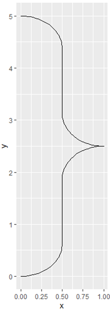
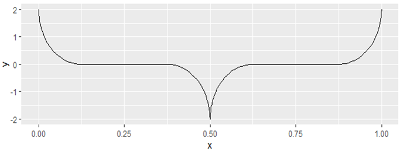
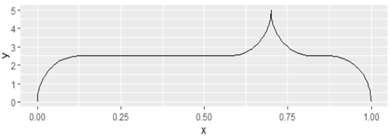

# curlyBraces

Wanna draw curly braces into your ggplot or plotly graph? This package provides the function seekBrace(), which outputs a data.frame, ready to be plotted.

## Installation
Install the culyBraces package from the git repository:
``` r
devtools::install_github("solatar/curlybraces")
```

## Default braces
Load the package, create your first brace and plot it with [ggplot2](https://ggplot2.tidyverse.org/):
``` r
library(curlyBraces, ggplot2)

mybrace <- seekBrace()
ggplot() + geom_line(aes(x,y), data=mybrace)
```

We can also produce a brace that points sideways instead of up or down. However, we must then spefify the orientation parameter in ggplot, otherwise our brace will end up as a zickzack line (if for some reason the above already results in a zickzack line for you, specify orientation="x"):

``` r
mybrace <- seekBrace(pointing="side")
ggplot() + geom_line(aes(x,y), data=mybrace, orientation="y")
```

You can add the geom_line() to your plot of choice to include the brace. Specify its x and y coordinates to put it wherever you want (see below).

## Custom braces
To put braces wherever you want in your graph, we can change the x and y coordinates of the bracket. This can also change where the bracket is pointing to. If yend is smaller then ystart, the brace will point downwards. If xend is smaller than xstart and parameter="side" is specified, it will point to the left.

``` r
mybrace <- seekBrace(ystart=2, yend= -2)
ggplot() + geom_line(aes(x,y), data=mybrace)
```

To change where the brace is pointing, we change the mid parameter. This is always between 0.25 and 0.75 (even if you type in something smaller or higher), with 0.5 being the default. 

``` r
mybrace <- seekBrace(mid=0.7)
ggplot() + geom_line(aes(x,y), data=mybrace)
```


## Customization via ggplot2
To change how the brace looks like, simply provide the arguements needed by ggplot. This includes the arguements: size, color and linetype (dashed, dotted, etc.)
``` r
ggplot() + geom_line(aes(x,y), curlyBraces::seekBrace(), linetype="dashed", color="red", size=3)
```
