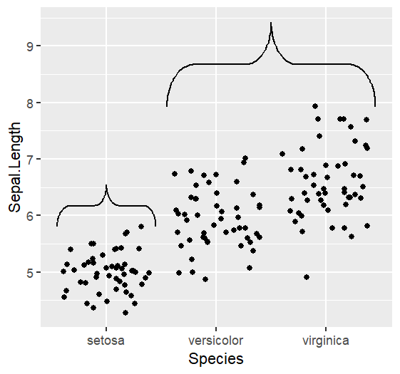

# ggbrace

An [R](https://www.r-project.org) package that draws curly braces in [ggplot2](https://ggplot2.tidyverse.org/).

# Table of contents
- [Updates](#Updates)
- [Installation](#Installation)
- [Default braces](#Plotting-braces)
- [Labels & Modifications](#Labels-&-Modifications)
- [Outside of plotting area](#Outside-of-plotting-area)
- [Discrete values](#Discrete-values)


# Updates
Version 0.1.1 (Feb 2024) of ggbrace removed the original `geom_brace` function, which plots braces within the confines of the x-y-values. The same functionality can now be achieved with `stat_brace( outside = FALSE )`. Additionally, the text functionality is now its own function `stat_bracetext` which allows for more customization of the text using the same arguments that would be used in `geom_text` or `geom_label`. By default `stat_brace` uses `geom="text"` which can be changed e.g. by `stat_brace(geom="label")`.


# Installation
Install the package from CRAN
``` r
install.packages("ggbrace")
```
or from this git repository:
``` r
devtools::install_github("nicolash2/ggbrace")
```

# Plotting braces
The new version of ggbrace uses only `stat_brace` to automatically enclose data points. `stat_bracetext` is used to generate fitting text.

In our example we use the iris data to create a dotplot. Then we look at how each of the three different modes draws braces to that plot.

``` r
library(ggplot2)
library(ggbrace)
data(iris)

plt <- ggplot(iris, aes(x=Sepal.Length, y=Sepal.Width, color=Species, label=Species)) + 
  geom_point() +
  theme_classic() +
  theme(legend.position="none")

plt + stat_brace()
```


# Labels & Modifications

## Labels

We can add labels to the braces. For that the `stat_bracetext` is used.

``` r
plt + 
  stat_brace() +
  stat_bracetext()
```


We can modify the text in the same way we would modify other text in ggplot. We can also switch between different text geoms (e.g. `geom=label`).

``` r
plt + 
  stat_brace() +
  stat_bracetext(size=6, angle=15, fontface="bold")
```


## Rotation

We can rotate the braces by 90, 180 or 270 degrees via the `rotate` argument. Note that any changes in `stat_brace` also have to be made in `stat_bracetext` so that the text appears at the right position

``` r
plt + 
  stat_brace(rotate = 90) + 
  stat_bracetext(rotate = 90)
```


## Location

By default, the location of the brace is beside the data points by default. We can change that by setting the paramter `outside` to `FALSE`.

```r
plt + stat_brace(outside = FALSE)
```


By default, braces have a position and shape that is calculated based on their data points.The position can be changed with the parameters `distance` (to the data points) and `outerstart` (in the coordinate system). The width of the braces can be set with the `width` argument (absolute coordinate system units), while the bending of the brace can be set with `bending` (number from 0 to 1).

```r
plt + stat_brace(distance = 2) # the braces are put at a defined distance to the last data point of their group
plt + stat_brace(outerstart = 5) # all braces are put at the same position
plt + stat_brace(outerstart = 5, width = 1) # all braces get the same width
plt + stat_brace(outerstart = 5, width = 1, bending = 0.1) # all braces get the same curvature
```


# Outside of plotting area

To vizualize the brace outside of the plotting area, we can simply use two ggplot2 functions. 
- `coord_cartesian` needs to be mentioned with x and/or y range of the plotting area and the parameter `clip="off"` to allow plotting of objects outside of that area.
- within the `theme` function, `plot.margin` needs to be set to expand the outside area. This happens with 4 numbers (above, right, below, left). This can best be achieved with the `"npc"` unit, as it reflects the plot units and is therefore maintained independent of the pixels, cm, etc. Other units can be seen with ?unit (under grid).
```r
plt + stat_brace(outerstart = 4.5) + 
  coord_cartesian(y=range(iris$Sepal.Width), clip = "off") + #for the range just use the data for the respective axis
  theme(plot.margin = unit(c(0.25, 0.11, 0.11, 0.11), units="npc"))
```


# New Features - only in github version

## Discrete/Categorical axis

Use `discreteAxis=TRUE` to ensure the braces embrace the category.

```r
df <- iris
df$Group <- substring(iris$Species,1,1)
ggplot(df, aes(x=Species, y=Sepal.Length, group=Group)) +
    geom_jitter() +
    stat_brace(discreteAxis=TRUE)
```



## Square brackets

Use `bracketType="square"` to produce square brackets instead of curly ones. The bracket have the same width as the curly ones in order to comply with the text. Use the `width` parameter to adjust their size.

```r
plt + stat_brace(bracketType="square", width=.2)
```


