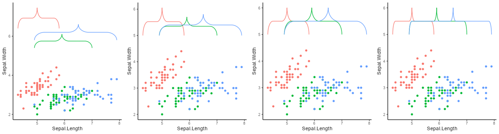

# ggbrace

An [R](https://www.r-project.org) package that draws curly braces in [ggplot2](https://ggplot2.tidyverse.org/).

# Table of contents
- [Installation](#Installation)
- [Default braces](#Default-braces)
- [Labels & Modifications](#Labels-&-Modifications)
- [Outside of plotting area](#Outside-of-plotting-area)
- [Discrete values](#Discrete-values)


# Installation
Install the package from the git repository:
``` r
devtools::install_github("nicolash2/ggbrace")
```

# Default braces
ggbrace has 3 ways of creating braces:
- `geom_brace #(manual mode)`: manually define border for the braces and set (`inherit.data=FALSE`)
- `geom_brace #(default mode)`: braces are drawn automatically in the confines of the data
- `geom_stat`: braces are drawn automatically to enclose data points

In our example we use the mtcars data to create a dotplot. Then we look at how each of the three different modes draws braces to that plot.

``` r
library(ggplot2)
library(ggbrace)

plt <- ggplot(iris, aes(x=Sepal.Length, y=Sepal.Width, color=Species, label=Species)) + 
  geom_point() +
  theme_classic() +
  theme(legend.position="none")
  
plt + geom_brace(aes(c(4,7), c(4, 4.5)), inherit.data=F)
plt + geom_brace()
plt + stat_brace()
```


# Labels & Modifications

## Labels

We can add labels to the braces. For that the `labelsize` parameter has to be set. The label for single braces with `geom_brace` must be defined as a string, whereas `stat_brace` and `geom_brace` with inherit.aes=T accept it in the mapping (we defined `label=Species` in the main plot already). As the third plot shows, we can also define the space between the brace pointer and the label.

``` r
plt + geom_brace(aes(c(4,7), c(4, 4.5), label="my label"), inherit.data=F, labelsize=5)
plt + geom_brace(labelsize = 5)
plt + stat_brace(labelsize = 5)
```


## Rotation

We can rotate the braces by 90, 180 or 270 degrees via the `rotate` arguement. The labels are not automatically rotated. For that we have to define the `labelrotate` arguement separately

``` r
plt + stat_brace(labelsize=5, rotate = 90)
plt + stat_brace(labelsize=5, rotate = 90, labelrotate=90)
plt + stat_brace(labelsize=5, rotate = 90, labelrotate=90, labeldistance = 1)
```


## Location

For `stat_brace`, the location of the brace is beside the data points. We can define how far away, where and how big the braces are. We can also define the `bending`, i.e. the curvature. This last parameter can also be set in `geom_brace` (not shown here).

```r
plt + stat_brace(distance = 2) # the braces are put at a defined distance to the last data point of their group
plt + stat_brace(outerstart = 5) # all braces are put at the same position
plt + stat_brace(outerstart = 5, width = 1) # all braces get the same width
plt + stat_brace(outerstart = 5, width = 1, bending = 0.1) # all braces get the same curvature
```


# Outside of plotting area

To vizualize the brace outside of the plotting area, we can simply use two ggplot2 functions. 
- `coord_cartesian` needs to be mentioned with x and/or y range of the plotting area and the parameter `clip="off"` to allow plotting of objects outside of that area.
- within the `theme` function, `plot.margin` needs to be set to expand the outside area. This happens with 4 numbers (above, right, below, left). This can best be achieved with the `"npc"` unit, as it reflects the plot units and is therefore maintained independent of the pixels, cm, etc. Other units can be seen with ?unit (under grid).
```r
plt + stat_brace(outerstart = 4.5) + 
  coord_cartesian(y=range(iris$Sepal.Width), clip = "off") + #for the range just use the data for the respective axis
  theme(plot.margin = unit(c(0.25, 0.11, 0.11, 0.11), units="npc"))
```


# Discrete values

Unfortunately, as of now, ggbrace isn't behaving well with discrete x/y axes, which is why they will have to be wrapped into the `seq_along` function within the `aes()`.

```r
df <- data.frame(x = c("a","b","c","d","e"), y = 1:5)     

ggplot(df, aes(x, y)) +
  geom_point() +
  stat_brace(aes(x=seq_along(x)))
```

This wrapping into the `seq_along` function is also used in the `coord_cartesian` function when trying to plot outside the plotting area.

```r
df <- data.frame(x = c("a","b","c","d","e"), y = 1:5)     

ggplot(df, aes(x, y)) +
  geom_point() +
  stat_brace(aes(x=seq_along(x)), rotate=90) +
  coord_cartesian(x=range(seq_along(df$x)), clip = "off") + 
  theme(plot.margin = unit(c(0.5, 7, 0.5, 0.5), units="lines")) #other units would be "cm" etc.
```
