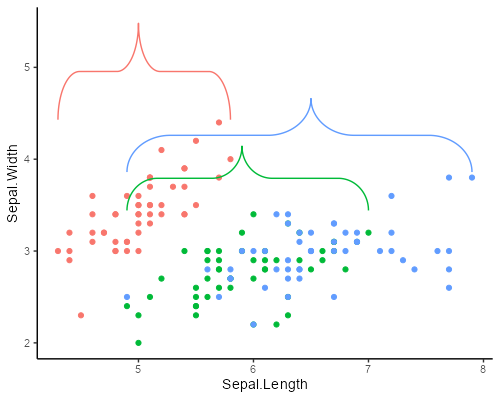
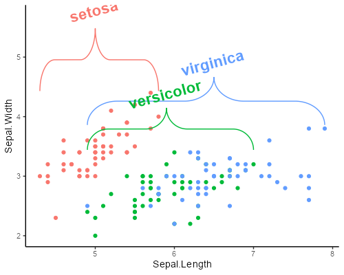

# ggbrace

An R package that draws highly modifiable curly braces in [ggplot2](https://ggplot2.tidyverse.org/). The brace can easily be modified and added to an existing ggplot object. ggbrace vizualizes the brace using a ggplot2's geom_path layer.


Table of contents:

- [Installation](#Installation)
- [Single Brace](#Single Brace)
- [Data-oriented Braces](#Data-oriented Braces)
- [Brace Customization](#Brace Customization)
- [Label Customization](#Label Customization)

# Installation
Install the package from the git repository:
``` r
devtools::install_github("nicolash2/ggbrace")
```

# Single Brace
Load the package, create a brace. You can also add a label.
``` r
library(ggbrace)
library(ggplot2)

ggplot() + geom_brace()
ggplot() + geom_brace(label="mylabel") + ylim(0,1.2)
```


Some basic brace adjustments:

- For a brace pointing sideways, specify "pointing="side".
- To invert the brace, define x and y coordinates so that the start is a higher number than the end.
- To change the pointer position within the brace, change the mid parameter. This is always between 0.25 and 0.75.
``` r
ggplot() + geom_brace(pointing="side") #point sideways
ggplot() + geom_brace(ystart=2, yend= -2) #point down instead of up
ggplot() + geom_brace(mid=0.7) #shift the brace pointer
```


# Data-oriented Braces

Instead of defining the brace location ourself, we can use the stat_brace function to generate braces that automatically indicate groups of data points. In these simple examples, we divide the mtcars dataset by the "am" column. The braces will automatically define the borders of the groups. With the rotate arguement we can get braces that point left, right or down.

``` r
ggplot(mtcars, aes(mpg, wt, color=factor(am))) + 
  geom_point() +
  stat_brace()

ggplot(mtcars, aes(mpg, wt, color=factor(am))) + 
  geom_point() +
  stat_brace(rotate=90)

ggplot(mtcars, aes(mpg, wt, color=factor(am))) + 
  geom_point() + 
  facet_wrap(~vs) + 
  stat_brace(rotate=90, aes(label=factor(am)))
```


# Brace Customization

To change how the brace looks like, simply provide the arguements needed by ggplot. This includes all arguements that could be given to geom_path: size, color, linetype, alpha (opacity), lineend and linejoin. The first 3 are examplified here.

``` r
ggplot() + geom_brace(linetype="dashed", color="blue", size=3, alpha=0.6)
```


If the size is bigger than usual, it might make sense to specify how the ends of the brace look like. This can be specified via the lineend and linejoin options (inherent to the ggplot2's geom_path object). They lead to subtle differences.

``` r
ggplot() + geom_brace(size=5, lineend="butt")
ggplot() + geom_brace(size=5, linejoin="mitre")
```


All possible options for:
- linetype: solid (default), dotted, dotdash, twodash, dashed, longdash, blank
- lineend: butt (default), square, round
- linejoin: round (default), mitre, bevel

# Label Customization

The label can be customized with the arguement labelsize and labelcolor, as well as any arguements that could be used for ggplot's annotate function, such as fontface or family.

``` r
ggplot() + 
  geom_brace(label="mylabel", labelcolor="red", fontface="bold") + 
  ylim(0,1.2)
```


